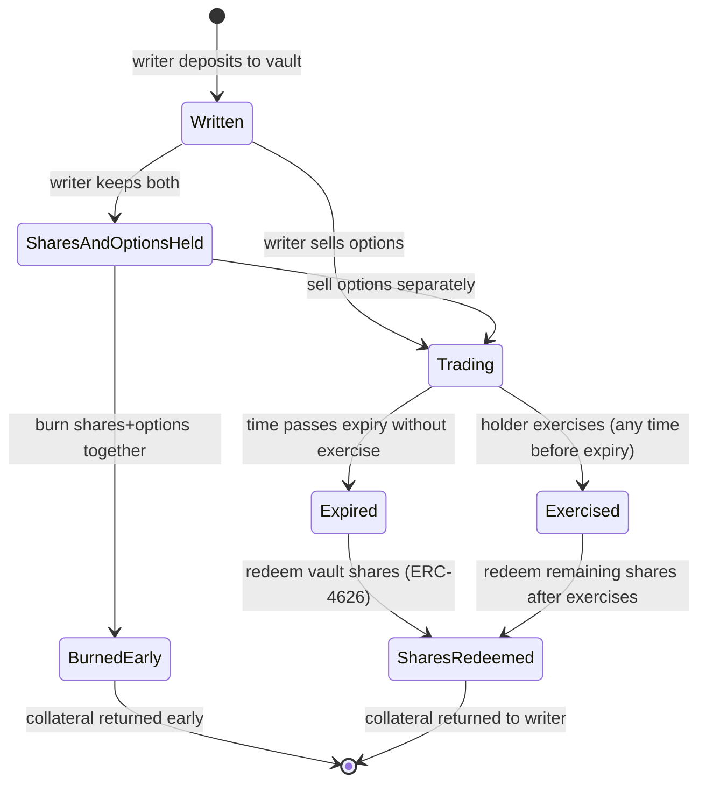
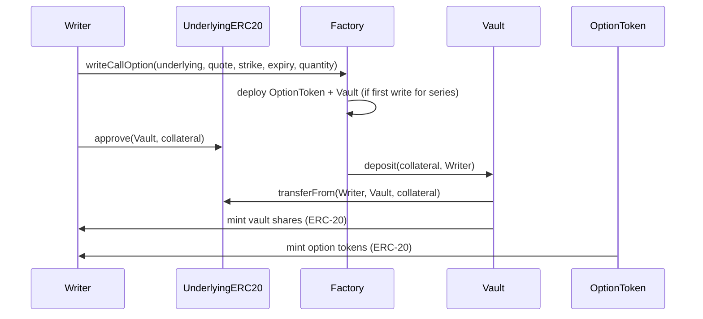
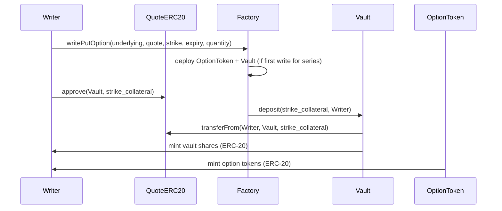
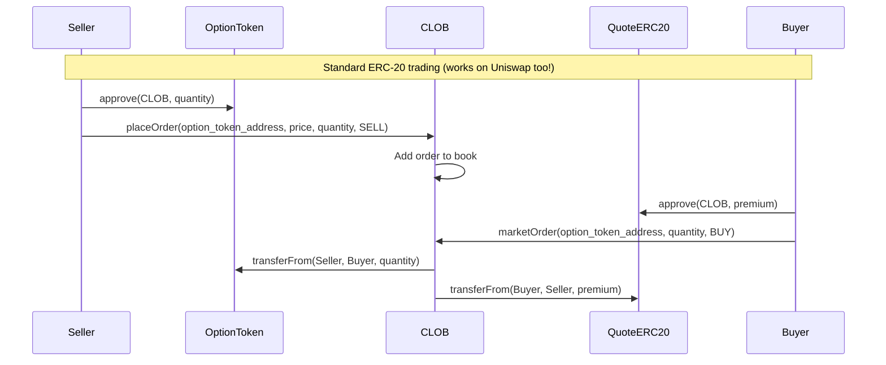
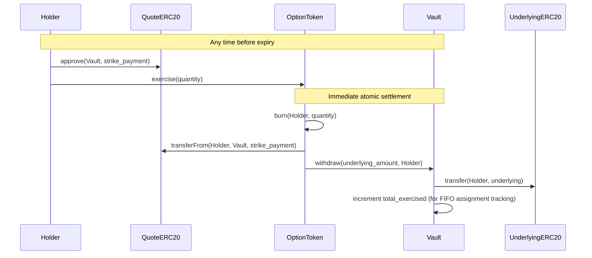
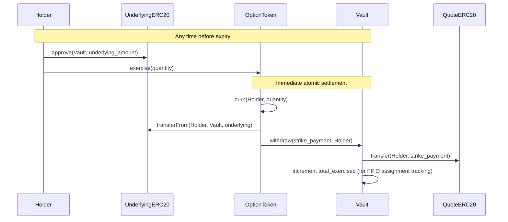
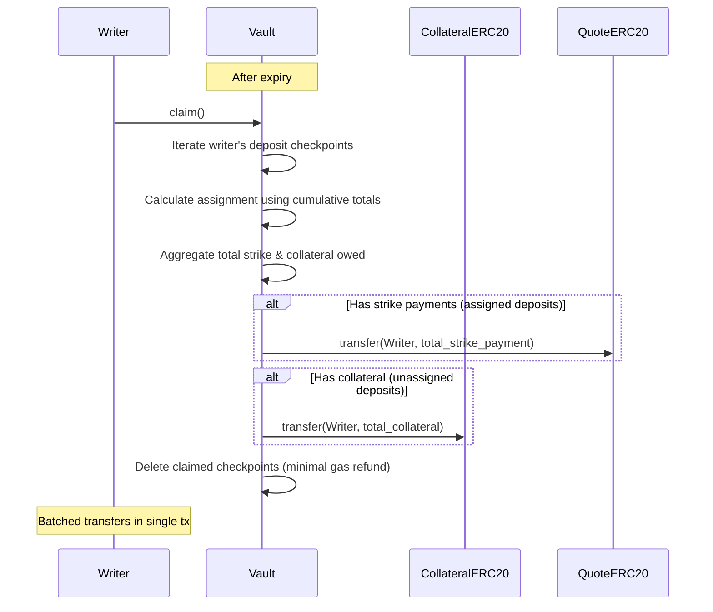
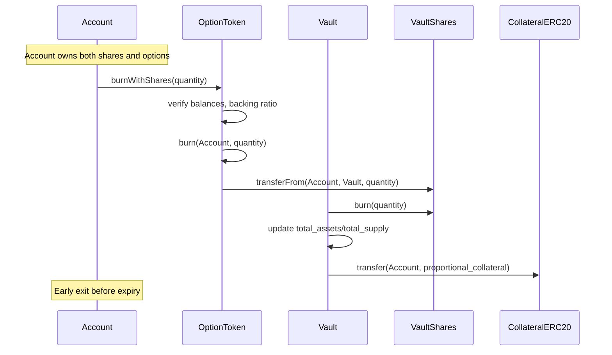

# SPEC.md

This specification outlines a fully on-chain Central Limit Order Book (CLOB) for
options trading, built on Arbitrum using Stylus (Rust/WASM) for
compute-intensive operations. The design prioritizes simplicity and reliability
through physical settlement with 100% collateralization, eliminating the need
for oracles, risk management systems, and liquidation mechanisms in the initial
version.

## Overview

### PoC Scope

- Users can write (sell) and buy options as ERC-20 tokens (one contract per
  series)
- Each option series has dedicated vault (ERC-4626) for collateral management
- Options trade on fully on-chain CLOB or any standard DEX (Uniswap, etc.)
- Settlement is physical (actual token delivery) with manual exercise
- All collateral is 100% locked in the underlying assets (no fractional reserve)
- ERC20 token pairs
- American options (exercise any time before expiry)

### Future work

- Cash settlement (requires oracles and risk management)
- Automatic exercise at maturity (requires oracles)
- Advanced order types
- Native token support

### Key Architectural Decisions

- **ERC-20 per Option Series**: Each option series is a separate ERC-20 contract
  - Maximum DeFi composability (works with all AMMs, lending, wallets)
  - Proven model (Opyn, established options protocols)
  - Factory pattern for efficient deployment (single activation cost)
  - Separate token from vault shares
    - Option token represents the right but not the obligation to exercise
      before maturity
    - Vault share token represents the right to the corresponding collateral if
      not assigned before maturity
    - Owning both allows users to burn the tokens and withdraw the collateral
      before maturity
- **Vault-Based Collateral**: ERC-4626 vaults manage collateral per option
  series
  - Writers deposit collateral, receive vault shares (ERC-20) + option tokens
    (ERC-20)
  - Both tokens independently transferrable
  - Exercise reduces vault assets, affecting all share holders proportionally
  - Enables standard DeFi composability for both tokens
- **Trustless by Design**: Physical settlement means no reliance on external
  price feeds
- **Simplicity First**: 100% collateralization eliminates complex risk
  management
- **FIFO Individual Assignment**: Writers assigned in deposit order (first
  deposits assigned first)
  - Cumulative checkpoints enable efficient binary search for cutoff
  - Strike payments distributed to assigned writers
  - Unassigned writers redeem collateral
  - No oracle needed for mixed-asset valuation
- **Future Compatible**: Architecture supports adding cash settlement and
  oracles later
- **Gas Efficient**: All contracts in Rust/Stylus for maximum performance
- **Permissionless**: Any ERC20 token pair can have options created

### Definitions

**Call Option**: Right (not obligation) to BUY the underlying ERC20 token at
strike price

- Holder: Pays premium, can exercise to buy underlying at strike price
- Writer: Receives premium, must deliver underlying token if holder exercises
- Collateral: Writer locks 1:1 underlying ERC20, e.g. 1 WBTC for 1 WBTC call
  (covered call)

**Put Option**: Right (not obligation) to SELL the underlying ERC20 token at
strike price

- Holder: Pays premium, can exercise to sell underlying at strike price
- Writer: Receives premium, must accept underlying and pay strike if holder
  exercises
- Collateral: Writer locks strike amount in quote token, e.g. $123,000 USDC for
  1 WBTC put at $123k strike (cash secured put)

---

**American Option**: An option that can be exercised at any time before or at
expiry. This PoC implements American-style exercise, allowing holders to
exercise immediately whenever profitable. The 100% collateralization model means
writers are always fully protected regardless of when exercise occurs.

---

**Physical Settlement**: Actual token delivery on exercise

- Call exercise: Holder pays strike in quote token -> receives underlying token
- Put exercise: Holder delivers underlying token -> receives strike in quote
  token
- No oracle required (holder decides if exercise is profitable)

## User Flows

#### Flow 1: Writing (Selling) an Option

Actors: Option Writer

Steps:

1. Writer selects option parameters (underlying ERC20, quote ERC20, strike,
   expiry, type, quantity)
2. Contract calculates required collateral based on option type
3. Writer approves ERC20 token transfer to vault contract
4. Contract executes:
   - Deploys new ERC-20 option token contract (if first write for this series)
   - Deploys new ERC-4626 vault contract (if first write for this series)
   - Deposits collateral into vault
   - Mints vault shares (ERC-20) to writer proportional to deposit
   - Mints option tokens (ERC-20) to writer equal to quantity
5. Writer can now sell option tokens via CLOB or any DEX, or hold them
6. Writer retains vault shares representing claim on collateral

Collateral:

- Calls: Underlying ERC20 tokens (1:1 ratio) deposited to underlying vault
- Puts: Quote ERC20 tokens (strike \* quantity) deposited to quote vault

Outcome:

- Option tokens (ERC-20) minted to writer
- Vault shares (ERC-20) minted to writer (separate token contract)
- Collateral deposited into vault
- Writer can trade both tokens independently

#### Flow 2: Trading Options

Actors: Maker, Taker

##### Adding Liquidity (Maker)

Steps:

1. Maker places a limit order
2. Maker's tokens locked:

- Selling: ERC-1155 option tokens locked
- Buying: Quote ERC20 locked (price \* quantity)

3. Order added to orderbook at specified price level
4. Order waits for taker

Outcome: Limit order in orderbook

##### Taking Liquidity (Taker)

Steps:

1. Taker places a market order
2. Matching engine fills against best available prices:

- Buying: Matches ascending from best ask
- Selling: Matches descending from best bid

3. If insufficient liquidity for full quantity -> REVERT
4. If sufficient liquidity:

- ERC-1155 option tokens transfer: Seller -> Buyer
- Quote ERC20 premium transfer: Buyer -> Seller (at makers' prices)
- Maker orders filled/reduced (FIFO at each price)

Outcome: Taker receives full fill at makers' prices, or transaction reverts

#### Flow 3: Cancelling Orders

Actors: Maker

Steps:

1. Maker requests to cancel their order
2. Contract verifies order ownership
3. Order removed from orderbook
4. Locked tokens returned to maker:

- Sell orders: ERC-1155 option tokens unlocked
- Buy orders: Quote ERC20 unlocked

Outcome: Order deleted, locked tokens returned

#### Flow 4: Exercise (American-Style)

Actors: Option Holder

Steps:

1. Holder decides to exercise option tokens (any time before expiry)
2. Holder approves ERC20 token transfer to vault contract:
   - For calls: Quote tokens (strike payment)
   - For puts: Underlying tokens
3. Holder calls option token's `exercise(quantity)` function
4. Contract executes immediately:
   - Transfers holder's payment tokens to vault (strike for calls, underlying
     for puts)
   - Vault transfers corresponding assets to holder (underlying for calls,
     strike for puts)
   - Burns holder's ERC-20 option tokens
   - Vault total assets decrease, reducing value of all vault shares
     proportionally

**Constraints and Edge Cases:**

- **Partial exercise:** Holder can exercise any quantity <= their balance

  - Example: Own 10 options, exercise 7.5, keep 2.5 active

- **Timing:** Can exercise any time before expiry

  - Before expiry: Full exercise available
  - At/after expiry: Exercise disabled, options expire worthless

- **Requirements:**

  - Holder must have sufficient option token balance
  - Holder must have approved sufficient payment tokens to vault
  - Holder must have sufficient payment token balance
  - Transaction must occur before expiry timestamp
  - Vault must have sufficient collateral to settle exercise

- **No cancellation:** Exercise is immediate and irreversible

  - Tokens exchanged atomically in single transaction
  - No intermediate state

- **FIFO assignment:** Writers assigned in deposit order
  - Earlier deposits assigned first (FIFO queue)
  - Assigned writers receive strike payments
  - Unassigned writers redeem collateral
  - Holder doesn't specify which writer (assignment automatic)
  - Fair ordering based on deposit time

Outcome: Immediate settlement, tokens exchanged, option tokens burned, vault
assets reduced

#### Flow 5: Collateral/Strike Claim After Expiry (FIFO Assignment)

Actors: Option Writer

After expiry, writers claim either strike payments (if assigned) or collateral
(if not assigned) based on FIFO deposit order.

**Assignment Logic:**

- Writers assigned in deposit order (FIFO)
- First deposits up to `total_exercised` amount get assigned
- Assigned writers receive strike payments
- Unassigned writers receive collateral back

Steps:

1. Time passes beyond expiry timestamp
2. Writer calls `claim()` to retrieve their entitlement
3. Vault calculates assignment for each of writer's deposits:
   - Uses cumulative totals to determine if deposit was assigned
   - Aggregates total strike payments and collateral owed
4. Vault makes batched transfers:
   - Single transfer for total strike payments (if any assigned)
   - Single transfer for total collateral (if any unassigned)
5. Vault deletes claimed checkpoints (minimal gas refund)

**Constraints:**

- **Only after expiry:** Cannot claim until options expired
- **Single-step process:** Just call `claim()`, no setup needed
- **Per-deposit granularity:** Each deposit tracked individually with FIFO
  ordering
- **No time limit:** Writers can claim indefinitely after expiry
- **Gas scales with writer's deposit count:** More deposits = higher claim gas
  cost (typically 1-5 deposits per writer per series)

**Why FIFO assignment:**

- Fair: Earlier deposits take priority
- No oracle needed: Strike payments and collateral tracked separately
- Deterministic: Assignment based purely on deposit order and exercise count
- Simple: Single function call, no coordination needed

**Example:**

- Alice deposits 100 WBTC (index 0, cumulative: 100)
- Bob deposits 50 WBTC (index 1, cumulative: 150)
- Charlie deposits 75 WBTC (index 2, cumulative: 225)
- Total exercised: 120 WBTC

Assignment (calculated during claim):

- Alice (100): cumulative_before=0, fully assigned → receives 100 × strike in
  USDC
- Bob (50): cumulative_before=100, fully assigned → receives 50 × strike in USDC
- Charlie (75): cumulative_before=150, partially assigned (120-150=-30) →
  receives (20 × strike) USDC + 55 WBTC

Outcome: Writer receives strike payments (if assigned) or collateral (if not
assigned) in single batched transfer

#### Flow 6: Early Collateral Redemption (Burn Shares + Options)

Actors: Account holding both vault shares AND option tokens

Writers who retain both vault shares and option tokens can reclaim collateral
early by burning matching quantities of both, bypassing full exercise flow.

Steps:

1. Account verifies ownership of both:
   - Vault shares (ERC-20 from vault)
   - Option tokens (ERC-20 for same option series)
2. Account calls option token's `burnWithShares(quantity)` function
3. Contract verifies:
   - Account has sufficient vault shares
   - Account has sufficient option tokens
   - Quantity doesn't exceed available backing ratio
4. Contract executes atomically:
   - Burns option tokens from account
   - Burns vault shares from account
   - Transfers proportional collateral to account
   - Updates vault total assets and total supply

**Constraints:**

- **Matching quantities required:** Must burn equal amounts of shares and
  options
- **Backing ratio enforced:** Cannot burn more than vault can back
  - Example: Vault has 100 assets, 100 shares, 80 options outstanding
  - Can burn up to 80 shares+options (the limiting factor)
- **Any time before expiry:** Available throughout option lifecycle
- **Optimized path:** Cheaper than selling options then redeeming shares
  separately

**Why needed:**

- Writers who keep both shares and options can exit position early
- More gas-efficient than market selling + share redemption
- Useful when option is OTM and writer wants to close position
- Reduces total outstanding options, freeing vault capacity

**Example:**

Writer writes 10 calls, keeps 7 shares + 7 options, sells 3 options to market:

- Can burn 7 shares + 7 options to reclaim 70% of original collateral
- Remaining 3 shares stay in vault backing the 3 sold options
- After expiry (if not exercised), can redeem final 3 shares

Outcome: Both option tokens and vault shares burned, collateral returned early

### Option Lifecycle



### Contract execution flows

#### Write Call Option (Two-Token Model)



#### Write Put Option (Two-Token Model)



#### Trade Options (CLOB or Any DEX)



#### Call Exercise (Two-Token Model with FIFO Tracking)



#### Put Exercise (Two-Token Model with FIFO Tracking)



#### FIFO Assignment and Claim After Expiry



#### Early Redemption (Burn Shares + Options)



## Architecture

All contracts in Rust/WASM using Arbitrum Stylus SDK.

### Two-Token Architecture per Option Series

The system deploys **two separate ERC-20 tokens per option series**:

1. **Option Token (ERC-20)** - represents long position (right to exercise)
2. **Vault Share (ERC-4626/ERC-20)** - represents short position + collateral
   claim

Both tokens are independently transferrable, enabling separated long/short
option markets.

#### OptionFactory Contract

- **Factory pattern**: Deploys option token + vault pairs for new series
- **Single activation cost**: First deployment activates WASM, subsequent
  deploys free
- **Deterministic addresses**: Option parameters hash to predictable contract
  addresses
- **Registry**: Tracks all deployed option series
- **Permissionless**: Anyone can deploy new option series

#### OptionToken Contract (ERC-20 per series)

- **Standard ERC-20**: Full compatibility with all DeFi protocols
- **Exercise functionality**: `exercise(quantity)` burns tokens, coordinates
  settlement
- **Burn with shares**: `burnWithShares(quantity)` early exit if holder owns
  both
- **Vault integration**: Calls vault for collateral transfers during exercise
- **Immutable metadata**: Strike, expiry, underlying, quote hardcoded at
  deployment

#### OptionVault Contract (ERC-4626 per series)

- **One vault per option series** (1:1 with option token contract)
  - Example: WBTC/USDC 60k Call Dec-31 has:
    - OptionToken ERC-20 (tradeable call option)
    - OptionVault ERC-4626 (WBTC collateral pool)
  - Isolates collateral and risk per series
- **Collateral custody**: Holds ALL underlying/quote tokens for series
- **Share issuance**: Mints ERC-20 vault shares to writers proportional to
  deposits
- **Proportional settlement**: Exercises reduce vault assets, affecting all
  shareholders
- **Standard ERC-4626**: Full compliance for composability
- **Post-expiry redemption**: Writers redeem shares for remaining collateral
- **Backing enforcement**: Prevents share redemption if options outstanding

**Per-Series Isolation Rationale:**

- Risk isolation: Each series has separate collateral pool
- Simple accounting: No cross-series tracking needed
- Clear expiry: Vault lifecycle matches option lifecycle
- Predictable redemption: Share value only affected by same-series exercises

Trade-off: More contract deployments vs unified liquidity pool. Per-series
isolation prioritizes safety and simplicity.

#### Central Limit Order Book (CLOB)

- **Orderbook storage**: `StorageMap`-based price-time priority matching
- **Standard ERC-20 trading**: Works with any ERC-20 (option tokens, vault
  shares, other tokens)
- **Optional venue**: Options can also trade on Uniswap, Curve, any DEX
- **Requires approval**: Standard ERC-20 `approve()` pattern

#### Why This Design

**Two separate tokens per series:**

- **Option Token (ERC-20)** = Long exposure (right to exercise)
  - Holder can transfer/sell without affecting collateral
  - Burns on exercise
- **Vault Share (ERC-20)** = Short exposure + collateral claim
  - Writer exposed to assignment (share value decreases on exercise)
  - Redeemable for collateral after expiry
  - Transferrable (sell short position to exit)

**Writer flexibility:**

- Keep shares, sell options: remain exposed to FIFO assignment
- Sell both: full exit from position
- Keep both, burn together: reclaim collateral anytime
- FIFO assignment means earlier deposits have priority

**Universal composability:**

- Both tokens are standard ERC-20
- Trade on any DEX (Uniswap, Curve, Balancer)
- Use in lending (Aave, Compound)
- Aggregate in protocols (Yearn, Convex)

**FIFO assignment:**

- Writers assigned in deposit order (earlier = higher priority)
- Assignment calculated on-demand during claim using cumulative totals
- No oracle needed for mixed collateral/strike valuation
- Fair and deterministic
- Single function call, no coordination needed

### Stylus Contract Maintenance

**CRITICAL: Yearly Reactivation Requirement**

Stylus smart contracts must be reactivated every 365 days or after any
Stylus/ArbOS upgrade to remain callable. This applies to both OptionsToken and
CLOB contracts.

Reactivation process:

- Can be performed by anyone using `cargo-stylus` or the ArbWasm precompile
- Necessary because WASM is lowered to native machine code during activation
- Contracts become non-callable if not reactivated (collateral remains safe but
  locked)
- Recommend automated monitoring and reactivation infrastructure

### OptionFactory Contract

Responsibilities:

- Deploy new option token + vault pairs for option series
- Registry of all deployed option series
- Deterministic address calculation for existing series
- Single-activation WASM optimization (deploy implementation once, clone many
  times)

Storage Structure:

```rust
sol_storage! {
    #[entrypoint]
    pub struct OptionFactory {
        // Option series registry: seriesId -> (option_token, vault)
        StorageMap<B256, SeriesContracts> series_registry;

        // Implementation contracts for cloning
        StorageAddress option_token_implementation;
        StorageAddress option_vault_implementation;
    }

    pub struct SeriesContracts {
        address option_token;  // ERC-20 option token contract
        address vault;         // ERC-4626 vault contract
    }
}
```

**Factory Functions:**

- `create_option_series(underlying, quote, strike, expiry, option_type)` -
  Deploy new series
  - Sets `decimals_offset=3` for all vaults (uniform security, no pricing
    needed)
  - Deploys OptionToken + OptionVault pair
  - Registers series in registry
- `get_series(series_id)` - Get existing series contracts
- `series_id(params)` - Calculate deterministic series ID
- Uses minimal proxy pattern (EIP-1167) for gas-efficient cloning

### OptionToken Contract (per series)

Responsibilities:

- Standard ERC-20 token for option long positions
- Execute exercise by burning tokens and coordinating vault settlement
- Enable burning with vault shares for early exit
- Immutable option parameters (strike, expiry, underlying, quote)

Storage Structure:

```rust
sol_storage! {
    #[entrypoint]
    pub struct OptionToken {
        // ERC-20 state (from OpenZeppelin Stylus)
        Erc20 erc20;
        Erc20Metadata metadata;

        // Immutable option parameters
        address underlying;
        address quote;
        uint8 underlying_decimals;
        uint8 quote_decimals;
        uint256 strike;          // 18 decimals normalized
        uint256 expiry;
        uint8 option_type;       // 0 = Call, 1 = Put

        // Associated vault
        address vault;
    }
}
```

**OptionToken Functions:**

- Standard ERC-20: `transfer()`, `approve()`, `transferFrom()`, `balanceOf()`,
  etc.
- `exercise(quantity)` - Burn tokens, coordinate settlement with vault
- `burnWithShares(quantity)` - Burn both option tokens and vault shares for
  early exit
- View functions for option parameters

### Vault Contract (ERC-4626)

Responsibilities:

- Hold collateral for specific option series
- Mint/burn vault shares (ERC-20) to writers
- Execute proportional asset transfers on exercise
- Enforce redemption constraints (after expiry, backing ratio)
- Standard ERC-4626 interface for composability

Storage Structure:

```rust
sol_storage! {
    #[entrypoint]
    pub struct OptionVault {
        // ERC-4626 state (from OpenZeppelin Stylus)
        Erc4626 vault;
        Erc20 shares;
        Erc20Metadata metadata;

        // Option series this vault backs
        uint256 token_id;
        address options_contract;
        uint256 expiry;

        // Backing constraints
        uint256 options_outstanding;  // Total option tokens issued
        bool expired;                 // True after expiry timestamp

        // FIFO deposit tracking for assignment
        StorageMap<U256, DepositCheckpoint> checkpoints;  // index => deposit info
        StorageMap<Address, StorageVec<U256>> writer_checkpoints;  // writer => deposit indices
        StorageU256 checkpoint_count;
        StorageU256 total_exercised;  // Total options exercised
    }
}

#[derive(SolidityType)]
pub struct DepositCheckpoint {
    writer: Address,
    amount: U256,
    cumulative_total: U256,  // Running total for binary search
}

// Constructor implementation - hardcoded offset for security
impl OptionVault {
    pub fn constructor(&mut self, asset: Address) {
        // Hardcoded decimals_offset=3 (1000x security multiplier)
        // NOT a parameter - prevents bypass attacks
        self.vault.constructor(asset, U8::from(3));
    }
}
```

**Vault Initialization:**

```rust
// In OptionFactory when deploying vault
pub fn create_vault(asset: Address) -> Address {
    // Deploy vault with inflation attack protection
    // Vault internally hardcodes offset=3 (no parameter)
    let vault = OptionVault::new(asset);
    vault
}
```

**Vault Functions:**

- `constructor(asset)` - Initialize with hardcoded `decimals_offset=3` for
  inflation protection
- `deposit(assets, receiver)` - Writer deposits collateral, creates checkpoint
  with cumulative total
- `exercise_withdraw(assets, recipient)` - Called by OptionsToken during
  exercise, increments `total_exercised`
- `claim()` - Writer claims strike payments (if assigned) or collateral (if not
  assigned), calculated on-demand using cumulative totals
- `burn_shares_with_options(shares, account)` - Early redemption path
- Standard ERC-4626 view functions (totalAssets, convertToShares, etc.)

#### Token Decimals Normalization

ERC20 tokens have varying decimal places, e.g.

- Standard: 18 decimals (ETH, most tokens)
- Stablecoins: 6 decimals (USDC, USDT)
- Wrapped BTC: 8 decimals (WBTC)

**Normalization Strategy:**

All amounts are normalized to 18 decimals for internal calculations and token ID
generation.

For a token with $d$ decimals, normalize amount $a$ to 18 decimals:

$$\text{normalized amount} = a \times 10^{(18 - d)}$$

**Example: 1 WBTC (8 decimals) call at 60,000 USDC (6 decimals) strike**

Normalized underlying amount:
$$1 \times 10^{8} \times 10^{(18-8)} = 1 \times 10^{18}$$

Normalized strike price:
$$60000 \times 10^{6} \times 10^{(18-6)} = 60000 \times 10^{18}$$

**Collateral Requirements (in native decimals):**

- Call options: Lock $1 \times 10^{8}$ WBTC (1:1 underlying)
- Put options: Lock $60000 \times 10^{6}$ USDC (strike amount in quote token)

**Key Properties:**

- Token ID uniqueness: Same parameters always produce same token ID
- Decimal handling: Caller passes decimals as parameters (ERC20 `decimals()` is
  optional and unreliable)
- Precision: All math uses 18-decimal precision, convert to native decimals only
  for ERC20 transfers

#### Unsafe Token Handling

Certain ERC20 token types are incompatible with the options protocol and must be
handled carefully:

**Fee-on-Transfer Tokens:**

- Tokens that deduct fees during `transfer()` or `transferFrom()` (e.g., some
  deflationary tokens)
- **Problem:** Contract expects to receive amount $X$ but actually receives
  $X - \text{fee}$
- **Impact:** Collateral shortfall, can't settle all exercises
- **Protection:** Check balance before/after transfer, revert if mismatch
  detected (enforceable at contract level)
- **When detected:**
  - **Write time:** Fee-on-transfer collateral (underlying for calls, quote for
    puts) causes write to revert, preventing option creation
  - **Exercise time:** No detection needed - if underlying/quote becomes
    fee-on-transfer after writing, holder simply receives less tokens on
    exercise (better than not being able to exercise at all)

**Rebasing Tokens:**

- Tokens where balances change automatically (e.g., stETH, aTokens)
- **Problem:** Collateral amount changes over time, accounting breaks
- **Impact:** Either excess collateral benefits random party, or shortfall
  prevents settlement
- **Protection:** None at protocol level - permissionless system can't prevent
  use. Document risks clearly, advise against using rebasing tokens, but
  ultimately user's choice

**Tokens with Blacklists:**

- Tokens like USDC can blacklist addresses (e.g., OFAC sanctions)
- **Problem:** If writer gets blacklisted, can't return collateral or receive
  strike payment
- **Impact:** Funds locked permanently
- **Protection:** None - accept as known risk of using such tokens

**Arithmetic Overflow/Underflow:**

- Extreme decimal values or amounts could cause overflow in normalization math
- **Problem:** Normalizing very large amounts or tokens with many decimals:
  $a \times 10^{(18-d)}$ might exceed `uint256`
- **Protection:** Use checked arithmetic (Rust's `checked_mul`, `checked_pow`) -
  reverts automatically on overflow/underflow

**PoC Approach:** Fully permissionless - any ERC20 pair can be used, any decimal
count supported. Contract protects against fee-on-transfer (detectable) and
arithmetic overflow (checked math). For rebasing tokens and blacklist tokens,
users assume full risk. Buyer beware.

Storage Access Pattern:

- Individual position lookup: O(1) via StorageMap key
- Lazy loading: Only requested slots loaded via SLOAD
- SDK automatic caching: Multiple reads within transaction nearly free after
  first access

#### Storage Limitations & Design Tradeoffs

**StorageMap Constraints:**

Stylus StorageMap (equivalent to Solidity mapping) has critical limitations:

1. **No iteration:** Cannot enumerate keys or values

   - Cannot list all active options
   - Cannot find all positions for a user
   - Must track metadata separately

2. **No deletion:** Maps cannot be truly erased

   - Can only zero out values
   - Storage slots remain allocated
   - Impacts long-term storage costs

3. **No size queries:** Cannot get count of entries
   - Must maintain separate counter
   - Adds gas overhead for updates

**Implications for Options Contract:**

```rust
// CANNOT do this:
for position in positions.iter() { ... } // No iter() method

// MUST do this instead:
// 1. Track position IDs separately
mapping(address => uint256[]) user_position_ids;

// 2. Query specific positions
let position = positions.get(position_id);
```

**Design Decisions:**

- Store position lookups by deterministic key: `keccak256(writer, tokenId)`
- Use events for off-chain indexing (subgraph) to build queryable state
- Accept that on-chain enumeration is impossible without extra tracking

### CLOB Contract

Responsibilities:

- Maintain orderbooks per option series (ERC-1155 token ID)
- Match orders (price-time priority, FIFO)
- Transfer ERC-1155 tokens between traders (via approved transfers)
- Transfer quote ERC20 premium payments
- Cancel orders
- Query orderbook state

Storage Structure (draft, TBC)

```rust
sol_storage! {
    #[entrypoint]
    pub struct CLOB {
        // Orders at price: tokenId -> price -> order list
        mapping(uint256 => mapping(uint256 => Order[])) bid_orders;
        mapping(uint256 => mapping(uint256 => Order[])) ask_orders;

        // Best prices (must maintain manually)
        mapping(uint256 => uint256) best_bid;
        mapping(uint256 => uint256) best_ask;

        // Order lookup: orderId -> Order
        mapping(uint256 => Order) orders;

        // User's orders: user -> orderId[]
        mapping(address => uint256[]) user_orders;

        // Active price levels for scanning: tokenId -> price[]
        mapping(uint256 => uint256[]) active_bid_prices;
        mapping(uint256 => uint256[]) active_ask_prices;

        uint256 next_order_id;
    }

    pub struct Order {
        uint256 order_id;
        address maker;
        uint256 token_id;
        uint256 price;
        uint256 quantity;
        uint256 filled;
        uint8 side; // 0 = Buy, 1 = Sell
        uint256 timestamp;
    }
}
```

### CLOB Trading Safeguards

#### Front-Running Protection

**Price-time priority provides inherent protection:**

- Orders at same price level execute FIFO by timestamp
- Sequencer can't prioritize specific orders at same price level
- Prevents same-block order jumping

**Market order behavior:**

- PoC: Market orders revert if insufficient liquidity (all-or-nothing)
- No slippage protection parameters in PoC (full fill or revert)

**Limit order protection:**

- Makers set exact price, never worse execution
- Orders only fill at maker's price or better
- No slippage for makers

## Gas Optimization Targets (Arbitrum)

Estimated costs at 0.1 gwei gas price, $0.05 per transaction average:

**Option Series Deployment (First Time Only):**

- Deploy OptionToken + Vault (first series): approx. 14M gas (approx. $0.70)
  - WASM activation cost (one-time for implementation)
- Deploy OptionToken + Vault (subsequent): approx. 100k gas (approx. $0.005)
  - Clone pattern, no activation cost

**Write/Exercise Operations:**

- Write option (deposit to vault): approx. 180k gas (approx. $0.009)
  - Vault deposit, share minting, option token minting
  - First write includes contract deployment (~100k extra)
- Exercise (burn + settle): approx. 150k gas (approx. $0.0075)
  - ERC-20 burn, vault withdrawal, transfers
- Redeem shares after expiry: approx. 100k gas (approx. $0.005)
  - Standard ERC-4626 redemption
- Burn shares + options (early): approx. 120k gas (approx. $0.006)
  - Combined burn operation

**Trading Operations:**

- ERC-20 approve: approx. 50k gas (approx. $0.0025)
- ERC-20 transfer: approx. 65k gas (approx. $0.00325)
- Trade on Uniswap v2: approx. 100k gas (approx. $0.005)
- CLOB limit order: approx. 100k gas (approx. $0.005)
- CLOB market order (5 fills): approx. 250k gas (approx. $0.0125)

Target: Keep all operations under 300k gas to stay economically viable even at
higher gas prices.

## Security Considerations

### Testing Strategy

**Unit Testing with Motsu:**

- Pure Rust testing framework for Stylus contracts
- Mock VM affordances without running actual blockchain
- Test individual functions in isolation
- Fast feedback loop during development

**Property-Based Testing with Proptest:**

- Generate random test cases to find edge cases
- Invariant checking across random inputs
- Critical for financial contracts
- Example: verify collateral always covers maximum possible payout across random
  inputs

**Integration Testing:**

- Test OptionFactory deployment flows
- Test OptionToken <-> Vault interactions
- Test ERC-20 transfers and approvals
- Test settlement flows end-to-end (write to trade to exercise)
- Test CLOB with standard ERC-20 tokens
- Run locally or in CI (no testnet dependency)

### Attack Vectors & Mitigations

**ERC-4626 Inflation Attack:**

- **Attack:** First depositor deposits 1 wei, then directly transfers large
  amount to vault to inflate share price
- **Impact:** Subsequent depositors receive 0 shares due to rounding, attacker
  claims their deposits
- **Attack Window:** Only affects first deposit into new vault (first writer for
  each option series)
- **Mitigation: Virtual Shares + Decimals Offset (OpenZeppelin Stylus)**
  - Hardcoded `decimals_offset=3` in vault constructor (built into OpenZeppelin
    Stylus ERC-4626)
  - NOT a parameter - prevents bypass attacks where attacker deploys vault with
    offset=0
  - Virtual shares/assets included automatically, make attack unprofitable even
    with offset=0
  - Offset=3 provides 1000x security multiplier (attacker must donate 1000x to
    steal 1x)
  - No oracle or pricing data required (pure mathematical protection)
  - Uniform security across all option series regardless of underlying value
  - Maintains full ERC-4626 standard compliance
- **Why offset=3 specifically:**
  - offset=0: Virtual shares alone make attack unprofitable (attacker loss >=
    user deposit)
  - offset=3: 1000x amplification, extremely strong protection
  - offset=6: 1M x amplification, overkill for most use cases with higher gas
    costs
  - Tradeoff: offset=3 provides excellent security without excessive gas
    overhead
- **Why hardcoded (not parameter):**
  - Eliminates risk of deploying vault with weak/no protection
  - No configuration needed (simpler, safer)
  - Prevents factory implementation bugs from bypassing protection
- **Why Not Minimum Deposit:** Options have wildly different collateral values
  (1 WBTC vs 100 USDC), no pricing oracle to set appropriate minimums
- **Why Not Dead Shares:** Adds operational complexity (factory must hold all
  collateral tokens), offset is simpler and equally effective
- **Why Not Dynamic Offset:** Cannot determine "high-value" vs "low-value"
  without pricing oracle, fixed offset=3 provides uniform strong protection

**Reentrancy:**

- Stylus contracts follow checks-effects-interactions pattern
- Burn option tokens/shares BEFORE external transfers
- ERC-4626 standard includes reentrancy protection via SafeERC20
- Vault exercises must update `total_assets` before transfers

**Front-Running:**

- CLOB uses price-time priority (FIFO), inherently fair
- Arbitrum's sequencer provides some ordering guarantees
- Market orders vulnerable to sandwiching (add slippage limits before prod)
- Vault deposits/redeems vulnerable to share price manipulation

**Integer Overflow/Underflow:**

- Rust panics on overflow in debug mode
- Use `checked_add()`, `checked_mul()` in production
- Verify all math operations in critical paths
- ERC-4626 share calculations especially sensitive to overflow

**Collateral Theft:**

- No admin withdrawal functions
- Vault collateral only released through:
  1. Exercise settlement (holder receives underlying/strike)
  2. Share redemption (writer receives proportional assets)
  3. Burn shares + options (account receives collateral)
- Only OptionsToken contract can call vault's exercise functions

**Time Manipulation:**

- Expiry uses `block.timestamp` (Arbitrum block time)
- Miners have approx. 15 second influence on timestamp
- Not exploitable for 1+ hour expiries
- Vault redemption gates enforce expiry check

**Vault Share Manipulation:**

- Writers could sell vault shares separately from options
- **Impact:** Vault under-collateralized if shares sold but options still
  exercisable
- **Mitigation:** Track `options_outstanding` in vault, prevent redemption if
  exceeds backing
- **Additional:** Consider enforcing 1:1 options:shares backing ratio strictly

### Known Limitations & Risks

**Collateral Lock Risk:**

- 100% collateralization means capital inefficient vs cash-settled options
- Writers' collateral locked in vaults until expiry or early redemption
- Writers can exit early via:
  1. Burn shares + options together (if still hold both)
  2. Sell vault shares on DEX (loses exposure to unexercised collateral)
  3. Buy back options on market, then burn with shares
- American exercise helps: holders exercise early when ITM, freeing vault
  capacity

**Vault Share Management:**

- Writers must manage TWO tokens: vault shares (ERC-20) and options (ERC-1155)
- Selling shares without options creates risk: no claim on collateral if not
  exercised
- Selling options without shares creates exposure: still assigned if exercised
- Requires understanding of vault mechanics and backing ratios

**Post-Expiry FIFO Assignment:**

- Single-step process: Writer calls `claim()` after expiry
- Assignment calculated on-demand using cumulative deposit totals
- Assigned writers receive strike payments, unassigned receive collateral
- Batched transfers (one for strike, one for collateral) regardless of deposit
  count
- Gas cost scales with writer's deposit count (typically 1-5 deposits per
  series)
- Collateral/strike remain safe indefinitely until claimed

**Per-Series Vault Model:**

- Each option series has separate vault (no cross-collateralization)
- Writers must deposit separately for each strike/expiry combination
- Less capital efficient than unified vault per underlying
- Trade-off: Simplicity and risk isolation vs capital efficiency
- Future versions could aggregate vaults for better capital utilization

**ERC-4626 Composability Risks:**

- Vault shares tradeable on any DEX (standard ERC-20)
- Share buyers without options have no benefit (pure liability)
- Share price drops as exercises occur (asymmetric exposure)
- Not suitable for standard DeFi yield strategies
- Documentation must clearly explain vault shares ≠ typical yield-bearing tokens

## Future Work

### Event-Based Off-Chain Indexing

Improve queryability and UX without changing on-chain logic.

Features:

- Emit comprehensive events for every deposit with cumulative totals
- Build subgraph/indexer to track all deposits and calculate assignment status
  off-chain
- Frontend queries subgraph to show writers their entitlement before claiming
- On-chain `claim()` logic remains unchanged (calculates assignment
  independently)
- Off-chain indexer provides UX improvements only (not required for correctness)

Benefits:

- Better UX: Show assignment status before claim transaction
- Frontend can estimate gas costs pre-transaction
- Historical analytics and portfolio tracking
- Standard DeFi pattern (most protocols use events + subgraph)

Trade-offs:

- Requires off-chain infrastructure (subgraph deployment)
- Dependency on indexer for UX features (but not for core functionality)
- Additional frontend integration work

Requirements: Subgraph deployment, event indexing infrastructure, GraphQL
frontend integration

### Optimized FIFO Assignment (If Needed Later)

Add cutoff caching if many deposits per writer becomes common.

Current approach works well for typical usage (1-5 deposits per writer per
series). If protocol grows and individual writers frequently make 10+ deposits
to the same series, consider optimization:

Features:

- Add `finalize_expiry()` function to pre-calculate assignment cutoff via binary
  search (O(log n))
- Cache cutoff index in storage for all writers to reference
- `claim()` uses cached cutoff for early exit (skip checking remaining deposits
  once past cutoff)
- Enables better batching and gas savings for writers with many deposits

Gas savings:

- `finalize_expiry()`: ~30k once per series (amortized across all writers)
- Saves ~60k gas per deposit beyond cutoff for each writer
- Only beneficial when average deposits per writer > 10

Implementation: Add `exercise_cutoff_index` to storage, add `finalize_expiry()`
function, update `claim()` to check cutoff first

Decision: Implement only if data shows it's needed (YAGNI principle)

### Automatic Exercise & Cash Settlement

Features:

- Automatic exercise of ITM options at expiry (no manual action required)
- Cash settlement option (receive profit in quote token instead of physical
  delivery)
- Better capital efficiency (quote token collateral for calls when cash-settled)

Requirements: Oracle integration for determining ITM status and settlement
prices

### Flash-Loan-Compatible Exercise (Oracle-Free Alternative)

Alternative to oracle-based cash settlement using arbitrage mechanics for price
discovery.

**Mechanism:** Arbitrageurs use flash loans to atomically: borrow strike payment
-> exercise option -> sell underlying on DEX -> repay loan -> keep profit.
Transaction only succeeds if truly ITM; market liquidity reveals true price
without oracles.

**Key Properties:**

- Eliminates oracle manipulation risk ($400M+ losses in 2022)
- Maximally decentralized (only trusts blockchain + proven AMMs)
- Best for liquid assets with deep DEX markets (ETH, WBTC, major tokens)
- Not suitable for long-tail assets without DEX liquidity

**Examples:** Primitive Finance (first implementation), Panoptic (perpetual
options on Uniswap v3, 5-10x capital efficiency)

**Trade-offs:** Zero oracle risk vs limited to liquid pairs; superior capital
efficiency vs MEV vulnerability; permissionless vs requires sophisticated
arbitrageur network

Requirements: Flash loan integration (Aave/Balancer), deep DEX liquidity, MEV
protections

### Advanced Order Types

Features:

- Partial fills for market orders (fill-or-kill, immediate-or-cancel with
  minimum fill quantity)
- Market orders with slippage protection (max price per unit limits)
- Stop-loss and take-profit orders
- Spread orders (multi-leg strategies, e.g. vertical spreads / iron condors)
- Iceberg orders (hidden quantity)

Requirements: Enhanced orderbook logic, potentially off-chain sequencer for
complex conditional orders

### Capital Efficiency Improvements

Features:

- Partial collateralization for spread positions (recognize offsetting risk)
- Portfolio margining (single collateral pool across positions)
- Cross-account margin to reduce total capital requirements

Requirements: Sophisticated risk calculation, liquidation system, insurance fund

### Trading Improvements

Features:

- Minimum order sizes to prevent spam/dust orders (requires per-quote-token
  configuration)
- Price tick sizes for orderbook efficiency
- Maximum orders per user to prevent spam
- Maximum price levels and orders per level to bound gas costs
- RFQ system for large block trades
- Better price discovery mechanisms
- Gasless order submission

Requirements: Per-token parameter configuration, governance for setting limits,
off-chain infrastructure

### UX Enhancements

Features:

- Exercise reminders and notifications
- Token safety/popularity indicators
- Historical analytics and charts
- Standard expiry date suggestions

Requirements: Subgraph indexing, frontend improvements

## References & Resources

### Stylus Documentation

- [Stylus Gentle Introduction](https://docs.arbitrum.io/stylus/stylus-gentle-introduction)
- [Rust SDK Reference](https://docs.rs/stylus-sdk/latest/stylus_sdk/)
- [Stylus by Example](https://stylus-by-example.org)
- [OpenZeppelin Stylus Contracts](https://github.com/OpenZeppelin/rust-contracts-stylus)

### Stylus Storage Research

- Arbitrum Stylus Storage Patterns (project artifacts): Critical analysis of
  StorageMap limitations
- SwissBorg CLOB Benchmark: Red-Black tree showing 25% overhead vs Solidity
- Renegade Architecture: Off-chain orderbook with on-chain ZK settlement
- Superposition: AMM-first approach, future CLOB plans

### DeFi Options Research

- Opyn v1: American options, physical settlement, separate ERC20 per series
- Opyn Gamma (v2): European options, **cash settlement**, ERC20 tokens,
  oracle-based
- Premia Finance: **ERC-1155 options**, covered call/put with locked collateral,
  composable across DEXs
- Lyra V1: ERC-1155 implementation, AMM-based pricing
- Premia V3: Per-market isolation
- Hegic: Peer-to-pool liquidity (contrasting approach)

Note: Premia Finance is the most relevant reference for our ERC-1155 + physical
settlement design. Opyn Gamma moved to cash settlement to enable spreads and
margin efficiencies.

### Orderbook Design

- Serum DEX: Slab allocator for orderbook storage on Solana
- dYdX v3: Off-chain orderbook with on-chain settlement (proven model)
- Vertex Protocol: Hybrid CLOB architecture

### Data Structures

- [Rust Collections](https://doc.rust-lang.org/std/collections/)
- [BTreeMap (in-memory)](https://doc.rust-lang.org/std/collections/struct.BTreeMap.html)
- [VecDeque (in-memory)](https://doc.rust-lang.org/std/collections/struct.VecDeque.html)
- Stylus Storage Types: StorageMap, StorageVec in SDK documentation

### Testing & Security

- Motsu: Pure Rust testing framework for Stylus
- Proptest: Property-based testing in Rust
- OpenZeppelin Stylus Audit Report: Security patterns for Rust smart contracts

### Standards

- OCC Options Symbology: Standard ticker format
- ERC-1155: Multi-token standard specification
