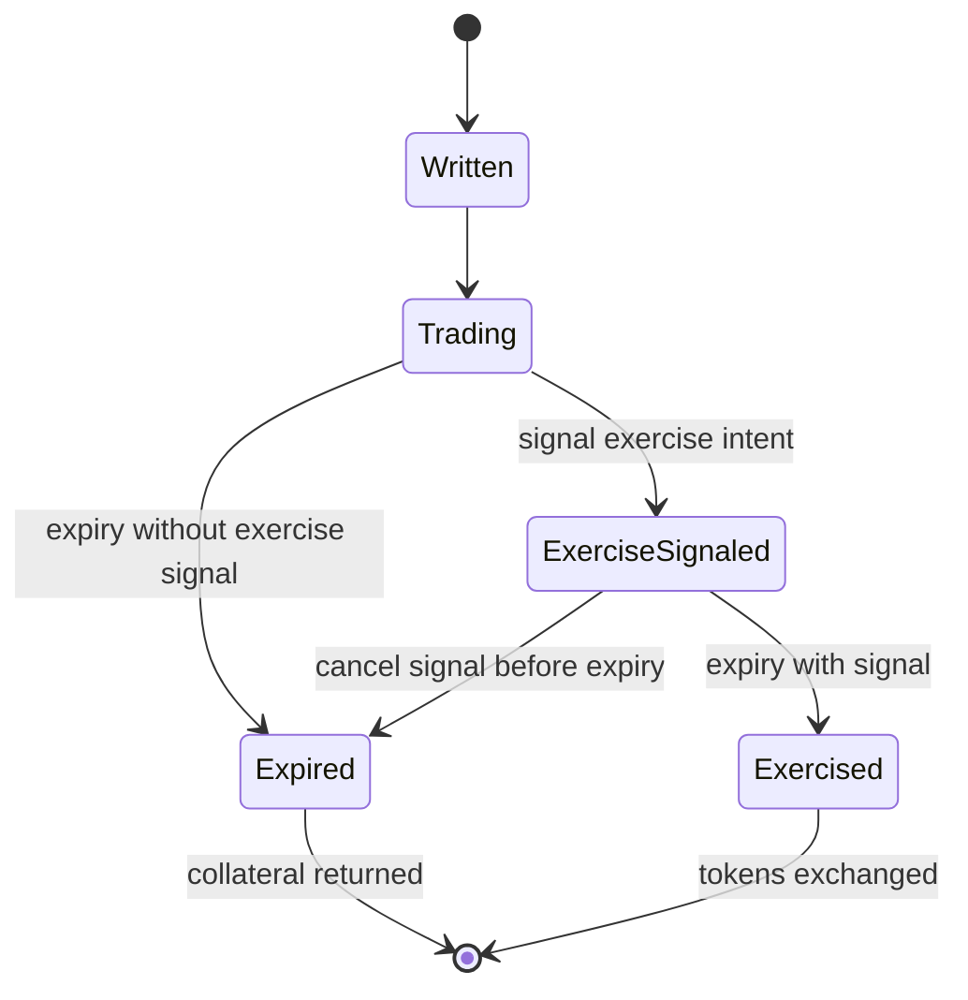
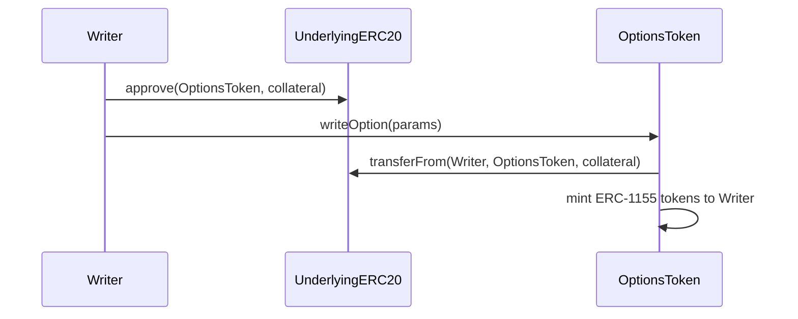
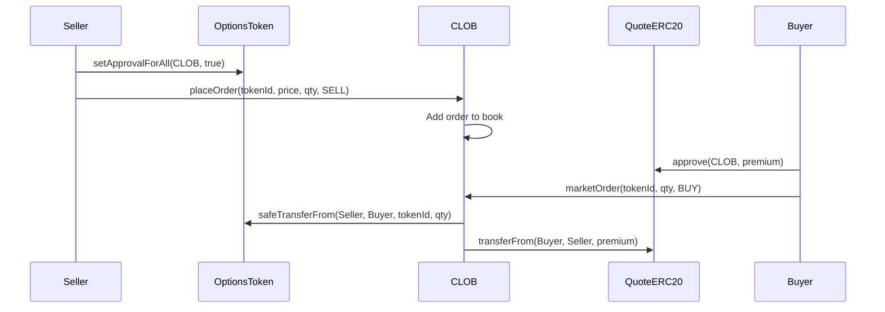
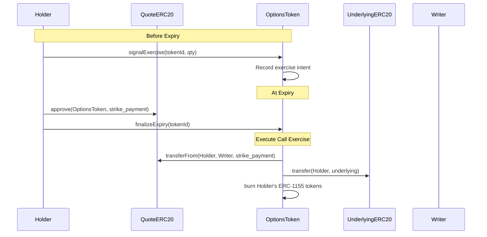
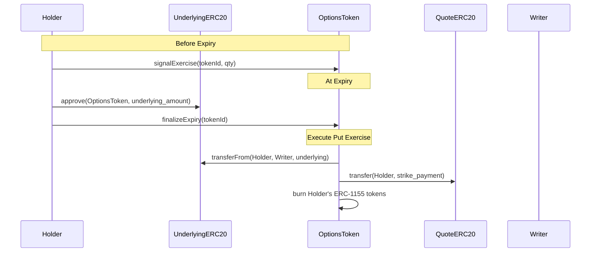
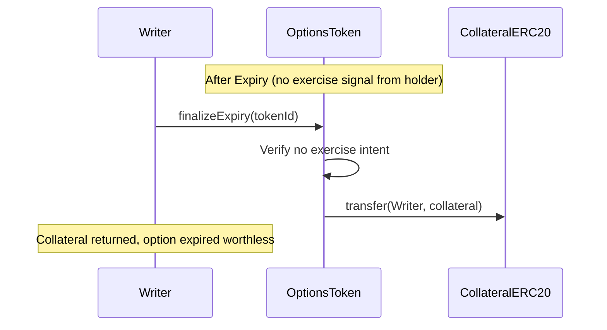

# SPEC.md

This specification outlines a fully on-chain Central Limit Order Book (CLOB) for options trading, built on Arbitrum using Stylus (Rust/WASM) for compute-intensive operations. The design prioritizes simplicity and reliability through physical settlement with 100% collateralization, eliminating the need for oracles, risk management systems, and liquidation mechanisms in the initial version.

## Overview

### PoC Scope

- Users can write (sell) and buy options as ERC-1155 tokens
- Options trade on a fully on-chain CLOB with price-time priority matching
- Settlement is physical (actual token delivery) with manual exercise
- All collateral is 100% locked in the underlying assets (no fractional reserve)
- ERC20 token pairs
- European options

### Future work

- Cash settlement (requires oracles and risk management)
- Automatic exercise at maturity (requires oracles)
- Advanced order types
- Native token support
- American options

### Key Architectural Decisions

- **Trustless by Design**: Physical settlement means no reliance on external price feeds
- **Simplicity First**: 100% collateralization eliminates complex risk management
- **Future Compatible**: Architecture supports adding cash settlement and oracles later
- **Gas Efficient**: All contracts in Rust/Stylus for maximum performance
- **Permissionless**: Any ERC20 token pair can have options created

### Definitions

**Call Option**: Right (not obligation) to BUY the underlying ERC20 token at strike price

- Holder: Pays premium, can exercise to buy underlying at strike price
- Writer: Receives premium, must deliver underlying token if holder exercises
- Collateral: Writer locks 1:1 underlying ERC20, e.g. 1 WBTC for 1 WBTC call (covered call)

**Put Option**: Right (not obligation) to SELL the underlying ERC20 token at strike price

- Holder: Pays premium, can exercise to sell underlying at strike price
- Writer: Receives premium, must accept underlying and pay strike if holder exercises
- Collateral: Writer locks strike amount in quote token, e.g. $123,000 USDC for 1 WBTC put at $123k strike (cash secured put)

---

**European Option**: An option that can only be exercised at maturity.

**American Option**: An option that can be exercised at or before maturity.

---

**Physical Settlement**: Actual token delivery on exercise

- Call exercise: Holder pays strike in quote token → receives underlying token
- Put exercise: Holder delivers underlying token → receives strike in quote token
- No oracle required (holder decides if exercise is profitable)

## User Flows

#### Flow 1: Writing (Selling) an Option

Actors: Option Writer
Steps:

1. Writer selects option parameters (underlying ERC20, quote ERC20, strike, expiry, type, quantity)
2. Contract calculates required collateral based on option type
3. Writer approves ERC20 token transfer to contract
4. Contract transfers collateral from writer
5. Contract mints ERC-1155 option tokens to writer
6. Writer can now sell these tokens via CLOB or elsewhere or hold them

Collateral:

- Calls: Underlying ERC20 tokens (1:1 ratio)
- Puts: Quote ERC20 tokens (strike × quantity)

Outcome: Option tokens (ERC-1155) minted, collateral (ERC20) locked

#### Flow 2: Trading Options

Actors: Maker, Taker

##### Adding Liquidity (Maker)

Steps:

1. Maker places a limit order
2. Maker's tokens locked:
  - Selling: ERC-1155 option tokens locked
  - Buying: Quote ERC20 locked (price × quantity)
3. Order added to orderbook at specified price level
4. Order waits for taker

Outcome: Limit order in orderbook

##### Taking Liquidity (Taker)

Steps:

1. Taker places a market order
2. Matching engine fills against best available prices:
  - Buying: Matches ascending from best ask
  - Selling: Matches descending from best bid
3. If insufficient liquidity for full quantity -> REVERT
4. If sufficient liquidity:
  - ERC-1155 option tokens transfer: Seller -> Buyer
  - Quote ERC20 premium transfer: Buyer -> Seller (at makers' prices)
  - Maker orders filled/reduced (FIFO at each price)

Outcome: Taker receives full fill at makers' prices, or transaction reverts

#### Flow 3: Cancelling Orders

Actors: Maker

Steps:

1. Maker requests to cancel their order
2. Contract verifies order ownership
3. Order removed from orderbook
4. Locked tokens returned to maker:
  - Sell orders: ERC-1155 option tokens unlocked
  - Buy orders: Quote ERC20 unlocked

Outcome: Order deleted, locked tokens returned

#### Flow 4: Exercise Intent (Before Expiry)

Actors: Option Holder

Steps:

1. Holder signals intent to exercise specific option tokens any time before expiry
2. Contract records holder's exercise intent
3. Holder can change intent by canceling exercise signal before expiry
4. At expiry, contract processes all recorded exercise intents

Outcome: Exercise intent recorded, reversible until expiry

#### Flow 5: Settlement at Expiry

Actors: Option Holder, Option Writer, Anyone (for finalization)

Automatic Processing at Expiry

- All options with exercise intent: execute automatically
- All options without exercise intent: collateral unlocked for writer

##### Call Exercise (automatic if signaled)

Steps:

1. Contract transfers quote ERC20 (strike amount): Holder to Writer
2. Contract transfers underlying ERC20: Locked collateral to Holder
3. ERC-1155 option tokens burned from holder

##### Put Exercise (automatic if signaled)

Steps:

1. Contract transfers underlying ERC20: Holder to Writer
2. Contract transfers quote ERC20 (strike amount): Locked collateral to Holder
3. ERC-1155 option tokens burned from holder

##### Non-Exercise (automatic if not signaled)

Steps:

1. Contract returns full collateral ERC20 to writer
2. ERC-1155 option tokens burned from holder

##### Finalization

- Anyone can trigger settlement processing for expired options
- Contract executes all pending settlements based on recorded exercise intents

Outcome: Tokens exchanged per exercise intent, or collateral returned

### Option Lifecycle

### Contract execution flows

#### Write an Option

#### Trade Options

#### Call Exercise

#### Put Exercise

#### Non-Exercise Settlement

