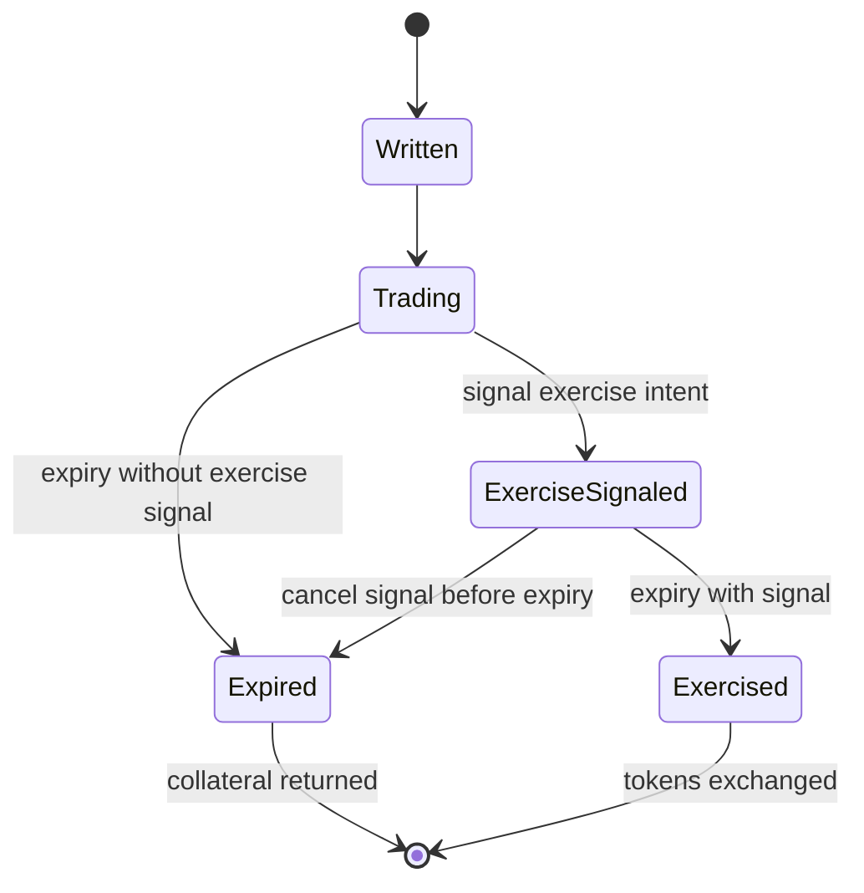
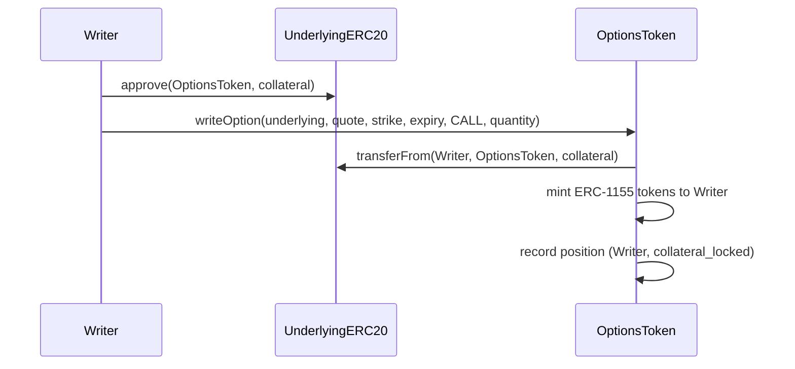
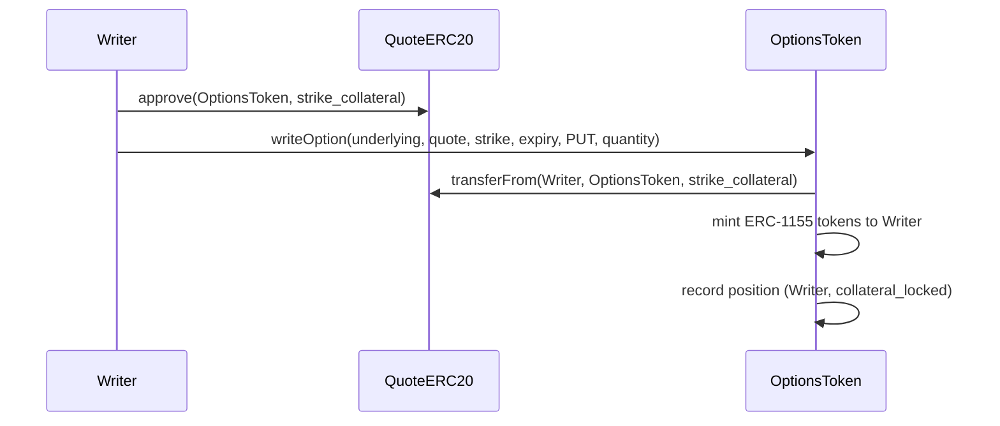
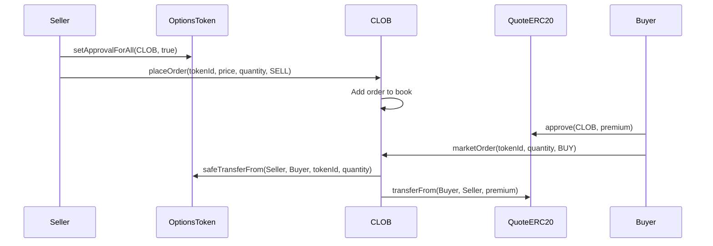
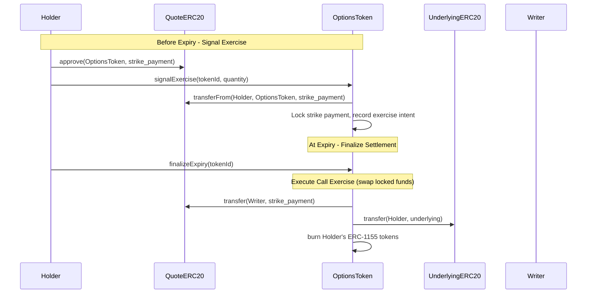
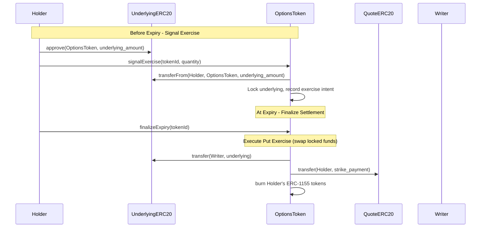
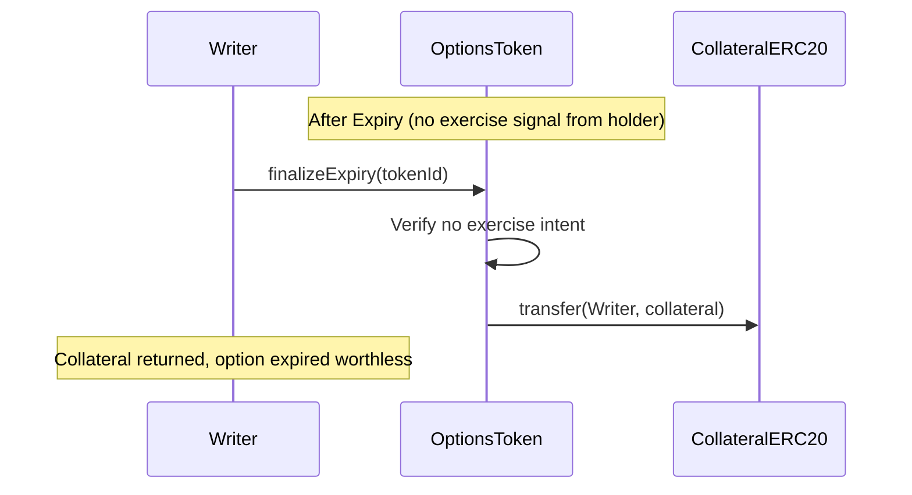

# SPEC.md

This specification outlines a fully on-chain Central Limit Order Book (CLOB) for options trading, built on Arbitrum using Stylus (Rust/WASM) for compute-intensive operations. The design prioritizes simplicity and reliability through physical settlement with 100% collateralization, eliminating the need for oracles, risk management systems, and liquidation mechanisms in the initial version.

## Overview

### PoC Scope

- Users can write (sell) and buy options as ERC-1155 tokens
- Options trade on a fully on-chain CLOB with price-time priority matching
- Settlement is physical (actual token delivery) with manual exercise
- All collateral is 100% locked in the underlying assets (no fractional reserve)
- ERC20 token pairs
- European options

### Future work

- Cash settlement (requires oracles and risk management)
- Automatic exercise at maturity (requires oracles)
- Advanced order types
- Native token support
- American options

### Key Architectural Decisions

- **Trustless by Design**: Physical settlement means no reliance on external price feeds
- **Simplicity First**: 100% collateralization eliminates complex risk management
- **Future Compatible**: Architecture supports adding cash settlement and oracles later
- **Gas Efficient**: All contracts in Rust/Stylus for maximum performance
- **Permissionless**: Any ERC20 token pair can have options created

### Definitions

**Call Option**: Right (not obligation) to BUY the underlying ERC20 token at strike price

- Holder: Pays premium, can exercise to buy underlying at strike price
- Writer: Receives premium, must deliver underlying token if holder exercises
- Collateral: Writer locks 1:1 underlying ERC20, e.g. 1 WBTC for 1 WBTC call (covered call)

**Put Option**: Right (not obligation) to SELL the underlying ERC20 token at strike price

- Holder: Pays premium, can exercise to sell underlying at strike price
- Writer: Receives premium, must accept underlying and pay strike if holder exercises
- Collateral: Writer locks strike amount in quote token, e.g. $123,000 USDC for 1 WBTC put at $123k strike (cash secured put)

---

**European Option**: An option that can only be exercised at maturity.

**American Option**: An option that can be exercised at or before maturity.

---

**Physical Settlement**: Actual token delivery on exercise

- Call exercise: Holder pays strike in quote token -> receives underlying token
- Put exercise: Holder delivers underlying token -> receives strike in quote token
- No oracle required (holder decides if exercise is profitable)

## User Flows

#### Flow 1: Writing (Selling) an Option

Actors: Option Writer
Steps:

1. Writer selects option parameters (underlying ERC20, quote ERC20, strike, expiry, type, quantity)
2. Contract calculates required collateral based on option type
3. Writer approves ERC20 token transfer to contract
4. Contract transfers collateral from writer
5. Contract mints ERC-1155 option tokens to writer
6. Writer can now sell these tokens via CLOB or elsewhere or hold them

Collateral:

- Calls: Underlying ERC20 tokens (1:1 ratio)
- Puts: Quote ERC20 tokens (strike * quantity)

Outcome: Option tokens (ERC-1155) minted, collateral (ERC20) locked

#### Flow 2: Trading Options

Actors: Maker, Taker

##### Adding Liquidity (Maker)

Steps:

1. Maker places a limit order
2. Maker's tokens locked:
  - Selling: ERC-1155 option tokens locked
  - Buying: Quote ERC20 locked (price * quantity)
3. Order added to orderbook at specified price level
4. Order waits for taker

Outcome: Limit order in orderbook

##### Taking Liquidity (Taker)

Steps:

1. Taker places a market order
2. Matching engine fills against best available prices:
  - Buying: Matches ascending from best ask
  - Selling: Matches descending from best bid
3. If insufficient liquidity for full quantity -> REVERT
4. If sufficient liquidity:
  - ERC-1155 option tokens transfer: Seller -> Buyer
  - Quote ERC20 premium transfer: Buyer -> Seller (at makers' prices)
  - Maker orders filled/reduced (FIFO at each price)

Outcome: Taker receives full fill at makers' prices, or transaction reverts

#### Flow 3: Cancelling Orders

Actors: Maker

Steps:

1. Maker requests to cancel their order
2. Contract verifies order ownership
3. Order removed from orderbook
4. Locked tokens returned to maker:
  - Sell orders: ERC-1155 option tokens unlocked
  - Buy orders: Quote ERC20 unlocked

Outcome: Order deleted, locked tokens returned

#### Flow 4: Exercise Intent (Before Expiry)

Actors: Option Holder

Steps:

1. Holder signals intent to exercise specific option tokens any time before expiry
2. Contract records holder's exercise intent
3. Holder can change intent by canceling exercise signal before expiry
4. At expiry, contract processes all recorded exercise intents

**Constraints and Edge Cases:**

- **Funds must be locked when signaling:**
  - Signaling exercise LOCKS the required funds immediately to prevent writer griefing
  - For **calls**: Holder's quote tokens (strike payment) locked in contract
  - For **puts**: Holder's underlying tokens locked in contract
  - Cannot signal without sufficient balance and approval
  - Prevents holder from blocking writer's collateral without committing funds

- **Partial quantities:** Holder can signal exercise for any quantity <= their balance
  - Example: Own 10 options, signal exercise for 7.5, keep 2.5 unexercised
  - Intent tracking: `exercise_intents[(holder, tokenId)] = quantity`
  - Locked funds: `locked_exercise_funds[(holder, tokenId, token)] = amount`

- **Transfer restrictions after signaling:**
  - Option tokens with exercise intent signaled become NON-TRANSFERABLE
  - ERC-1155 transfer blocked for signaled quantity
  - Holder must cancel exercise intent first to regain transferability
  - Remaining unsignaled tokens stay fully transferable
  - Prevents split between token ownership and exercise rights/locked funds

- **Signal deadline:**
  - Can signal any time before expiry block timestamp
  - Signals in same block as expiry are valid
  - No minimum advance notice required

- **Cancellation:**
  - Call `cancelExerciseIntent(tokenId, quantity)` before expiry
  - Returns locked funds to holder
  - Clears exercise intent
  - No penalty for cancellation
  - Cannot cancel after expiry

- **At expiry:**
  - All signaled exercises execute atomically
  - Locked funds from holder swap with writer's collateral
  - No approval checks needed (funds already locked)
  - No failure cases (deterministic settlement)

Outcome: Exercise intent recorded, reversible until expiry

#### Flow 5: Settlement at Expiry

Actors: Option Holder, Option Writer, Anyone (for finalization)

Automatic Processing at Expiry

- All options with exercise intent: execute automatically
- All options without exercise intent: collateral unlocked for writer

##### Call Exercise (automatic if signaled)

Steps:

1. Contract transfers quote ERC20 (strike amount): Holder to Writer
2. Contract transfers underlying ERC20: Locked collateral to Holder
3. ERC-1155 option tokens burned from holder

##### Put Exercise (automatic if signaled)

Steps:

1. Contract transfers underlying ERC20: Holder to Writer
2. Contract transfers quote ERC20 (strike amount): Locked collateral to Holder
3. ERC-1155 option tokens burned from holder

##### Non-Exercise (automatic if not signaled)

Steps:

1. Contract returns full collateral ERC20 to writer
2. ERC-1155 option tokens burned from holder

##### Finalization

Settlement processing can be triggered by anyone after expiry:

**Triggering mechanism:**
- Call `finalizeExpiry(tokenId)` or `finalizeExpiry(tokenId, holderAddress)` after expiry
- Contract executes settlements based on recorded exercise intents
- Can process individual holder or batch multiple holders in one tx

**Settlement Incentive Mechanism:**

PoC has no explicit incentive for third-party settlement finalization:
- Holders incentivized to finalize their own profitable exercises
- Writers incentivized to reclaim collateral for non-exercised options
- Gas cost: ~$0.03-0.05 per settlement on Arbitrum (acceptable for self-service)
- Anyone can call finalization functions permissionlessly

Future enhancement (if time permits): Small bounty mechanism
- Charge 0.1% settlement fee from collateral
- Pay to whoever triggers finalization
- Enables profitable third-party settlement bots
- Creates decentralized keeper network

**Settlement execution:**
- Since funds are locked when exercise is signaled, settlement is deterministic
- Simply swap locked holder funds with writer's collateral
- Burns option tokens from holder
- Atomic settlement guarantees

Outcome: Tokens exchanged per exercise intent, or collateral returned

### Option Lifecycle



### Contract execution flows

#### Write Call Option (No CLOB)



#### Write Put Option (No CLOB)



#### Trade Options



#### Call Exercise



#### Put Exercise



#### Non-Exercise Settlement



## Architecture

All contracts in Rust/WASM using Arbitrum Stylus SDK.

### Separate Contracts Design

#### OptionsToken Contract

- ERC-1155 token implementation (OpenZeppelin Stylus)
- Collateral custody for ALL options (all ERC20 tokens held here)
- Option minting/burning
- Exercise intent signaling
- Settlement execution at expiry
- Standalone functionality - users never need CLOB to use options

#### Central Limit Order Book (CLOB)

- Orderbook storage (`StorageMap`-based, see storage limitations below)
- Order matching engine (price-time priority)
- Trades existing ERC-1155 option tokens only
- Requires ERC-1155 approval from users
- Just one trading venue among many possible

#### Why Separate

- Options tokens fully composable (tradeable on AMMs, other DEXs, OTC)
- Users can write and exercise options without CLOB
- CLOB is optional trading venue, not core primitive
- Modular: upgrade CLOB without affecting options
- Clear security boundaries

### Stylus Contract Maintenance

**CRITICAL: Yearly Reactivation Requirement**

Stylus smart contracts must be reactivated every 365 days or after any Stylus/ArbOS upgrade to remain callable. This applies to both OptionsToken and CLOB contracts.

Reactivation process:
- Can be performed by anyone using `cargo-stylus` or the ArbWasm precompile
- Necessary because WASM is lowered to native machine code during activation
- Contracts become non-callable if not reactivated (collateral remains safe but locked)
- Recommend automated monitoring and reactivation infrastructure

### OptionsToken Contract

Responsibilities:

- Mint ERC-1155 tokens when options written
- Hold all collateral (underlying and quote ERC20s)
- Track writer positions and locked collateral
- Record exercise intents before expiry
- Execute settlements at expiry (exercise or return collateral)
- Burn tokens on exercise

Storage Structure (draft, TBC)

```rust
sol_storage! {
    #[entrypoint]
    pub struct OptionsToken {
        // ERC-1155 state (from OpenZeppelin)
        mapping(address => mapping(uint256 => uint256)) balances;
        mapping(address => mapping(address => bool)) operator_approvals;
        
        // Writer positions: (writer, tokenId) -> Position
        mapping(bytes32 => Position) positions;
        
        // Exercise intents: (holder, tokenId) -> quantity
        mapping(bytes32 => uint256) exercise_intents;
        
        // Option metadata: tokenId -> OptionMetadata
        mapping(uint256 => OptionMetadata) option_metadata;
        
        // Available collateral: (user, token) -> amount
        mapping(bytes32 => uint256) collateral_balances;
        
        // Total supply per token ID
        mapping(uint256 => uint256) total_supply;
    }
    
    pub struct Position {
        address writer;
        uint256 quantity_written;
        uint256 collateral_locked;
        address collateral_token;
    }
    
    pub struct OptionMetadata {
        address underlying;
        address quote;
        uint256 strike;
        uint256 expiry;
        uint8 option_type; // 0 = Call, 1 = Put
    }
}
```

Token ID is `keccak256` hash of

- Address of the underlying ERC20 token
- Address of the quote ERC20 token
- Strike price (normalized 18 decimals)
- Expiration timestamp
- Option kind (call/put)

#### Token Decimals Normalization

ERC20 tokens have varying decimal places, e.g.

- Standard: 18 decimals (ETH, most tokens)
- Stablecoins: 6 decimals (USDC, USDT)
- Wrapped BTC: 8 decimals (WBTC)

**Normalization Strategy:**

All amounts are normalized to 18 decimals for internal calculations and token ID generation.

For a token with $d$ decimals, normalize amount $a$ to 18 decimals:

$$\text{normalized\_amount} = a \times 10^{(18 - d)}$$

**Example: 1 WBTC (8 decimals) call at 60,000 USDC (6 decimals) strike**

Normalized underlying amount:
$$1 \times 10^{8} \times 10^{(18-8)} = 1 \times 10^{18}$$

Normalized strike price:
$$60000 \times 10^{6} \times 10^{(18-6)} = 60000 \times 10^{18}$$

**Collateral Requirements (in native decimals):**
- Call options: Lock $1 \times 10^{8}$ WBTC (1:1 underlying)
- Put options: Lock $60000 \times 10^{6}$ USDC (strike amount in quote token)

**Key Properties:**
- Token ID uniqueness: Same parameters always produce same token ID
- Decimal retrieval: Contract calls `decimals()` dynamically, never hardcoded
- Precision: All math uses 18-decimal precision, convert to native decimals only for ERC20 transfers
Storage Access Pattern:

- Individual position lookup: O(1) via StorageMap key
- Lazy loading: Only requested slots loaded via SLOAD
- SDK automatic caching: Multiple reads within transaction nearly free after first access

### CLOB Contract

Responsibilities:

- Maintain orderbooks per option series (ERC-1155 token ID)
- Match orders (price-time priority, FIFO)
- Transfer ERC-1155 tokens between traders (via approved transfers)
- Transfer quote ERC20 premium payments
- Cancel orders
- Query orderbook state

Interface (first draft, TBC)

```rust
sol_storage! {
    #[entrypoint]
    pub struct CLOB {
        // Orders at price: tokenId -> price -> order list
        mapping(uint256 => mapping(uint256 => Order[])) bid_orders;
        mapping(uint256 => mapping(uint256 => Order[])) ask_orders;
        
        // Best prices (must maintain manually)
        mapping(uint256 => uint256) best_bid;
        mapping(uint256 => uint256) best_ask;
        
        // Order lookup: orderId -> Order
        mapping(uint256 => Order) orders;
        
        // User's orders: user -> orderId[]
        mapping(address => uint256[]) user_orders;
        
        // Active price levels for scanning: tokenId -> price[]
        mapping(uint256 => uint256[]) active_bid_prices;
        mapping(uint256 => uint256[]) active_ask_prices;
        
        uint256 next_order_id;
    }
    
    pub struct Order {
        uint256 order_id;
        address maker;
        uint256 token_id;
        uint256 price;
        uint256 quantity;
        uint256 filled;
        uint8 side; // 0 = Buy, 1 = Sell
        uint256 timestamp;
    }
}
```

## Future Work

### Automatic Exercise & Cash Settlement

Features:

- Automatic exercise of ITM options at expiry (no manual action required)
- Cash settlement option (receive profit in quote token instead of physical delivery)
- Better capital efficiency (quote token collateral for calls when cash-settled)

Requirements: Oracle integration for determining ITM status and settlement prices

### Advanced Order Types

Features:

- Market orders with slippage protection
- Stop-loss and take-profit orders
- Spread orders (multi-leg strategies, e.g. vertical spreads / iron condors)
- Iceberg orders (hidden quantity)

Requirements: Enhanced orderbook logic, potentially off-chain sequencer for complex conditional orders

### Capital Efficiency Improvements

Features:

- Partial collateralization for spread positions (recognize offsetting risk)
- Portfolio margining (single collateral pool across positions)
- Cross-account margin to reduce total capital requirements

Requirements: Sophisticated risk calculation, liquidation system, insurance fund

### Trading Improvements

Features:

- RFQ system for large block trades
- Better price discovery mechanisms
- Gasless order submission

Requirements: Off-chain infrastructure for order collection and matching

### UX Enhancements

Features:

- Exercise reminders and notifications
- Token safety/popularity indicators
- Historical analytics and charts
- Standard expiry date suggestions

Requirements: Subgraph indexing, frontend improvements

## References & Resources

### Stylus Documentation

- [Stylus Gentle Introduction](https://docs.arbitrum.io/stylus/stylus-gentle-introduction)
- [Rust SDK Reference](https://docs.rs/stylus-sdk/latest/stylus_sdk/)
- [Stylus by Example](https://stylus-by-example.org)
- [OpenZeppelin Stylus Contracts](https://github.com/OpenZeppelin/rust-contracts-stylus)

### Stylus Storage Research

- Arbitrum Stylus Storage Patterns (project artifacts): Critical analysis of StorageMap limitations
- SwissBorg CLOB Benchmark: Red-Black tree showing 25% overhead vs Solidity
- Renegade Architecture: Off-chain orderbook with on-chain ZK settlement
- Superposition: AMM-first approach, future CLOB plans

### DeFi Options Research

- Opyn Gamma Protocol: Physical settlement, separate ERC20 per series
- Lyra V1: ERC-1155 implementation patterns
- Premia V3: Per-market isolation
- Hegic: Peer-to-pool liquidity (contrasting approach)

### Orderbook Design

- Serum DEX: Slab allocator for orderbook storage on Solana
- dYdX v3: Off-chain orderbook with on-chain settlement (proven model)
- Vertex Protocol: Hybrid CLOB architecture

### Data Structures

- [Rust Collections](https://doc.rust-lang.org/std/collections/)
- [BTreeMap (in-memory)](https://doc.rust-lang.org/std/collections/struct.BTreeMap.html)
- [VecDeque (in-memory)](https://doc.rust-lang.org/std/collections/struct.VecDeque.html)
- Stylus Storage Types: StorageMap, StorageVec in SDK documentation

### Testing & Security

- Motsu: Pure Rust testing framework for Stylus
- Proptest: Property-based testing in Rust
- OpenZeppelin Stylus Audit Report: Security patterns for Rust smart contracts

### Standards

- OCC Options Symbology: Standard ticker format
- ERC-1155: Multi-token standard specification

